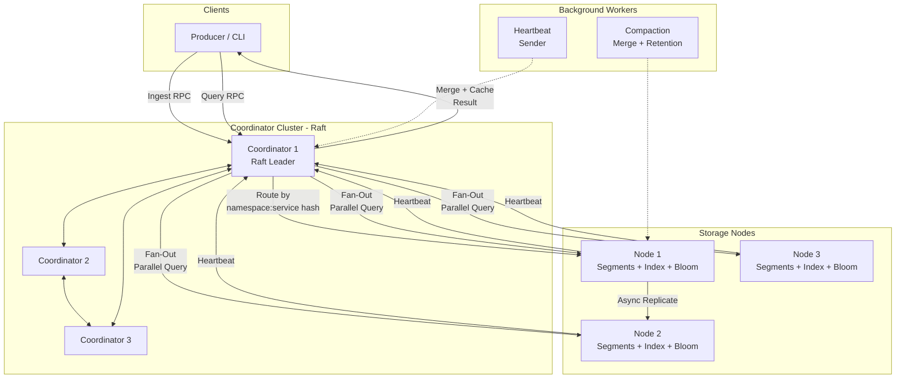

# Architecture Diagram

```mermaid
graph TB
    subgraph Clients
        P[Producer / CLI]
    end

    subgraph "Coordinator Cluster - Raft"
        CO1[Coordinator 1\nRaft Leader]
        CO2[Coordinator 2]
        CO3[Coordinator 3]
        CO1 <--> CO2
        CO2 <--> CO3
        CO1 <--> CO3
    end

    subgraph "Storage Nodes"
        N1[Node 1\nSegments + Index + Bloom]
        N2[Node 2\nSegments + Index + Bloom]
        N3[Node 3\nSegments + Index + Bloom]
    end

    subgraph "Background Workers"
        BG1[Compaction\nMerge + Retention]
        BG2[Heartbeat\nSender]
    end

    P -- "Ingest RPC" --> CO1
    CO1 -- "Route by\nnamespace:service hash" --> N1
    N1 -- "Async Replicate" --> N2

    P -- "Query RPC" --> CO1
    CO1 -- "Fan-Out\nParallel Query" --> N1
    CO1 -- "Fan-Out\nParallel Query" --> N2
    CO1 -- "Fan-Out\nParallel Query" --> N3
    CO1 -- "Merge + Cache\nResult" --> P

    N1 -- "Heartbeat" --> CO1
    N2 -- "Heartbeat" --> CO1
    N3 -- "Heartbeat" --> CO1

    BG1 -.-> N1
    BG2 -.-> CO1
```
