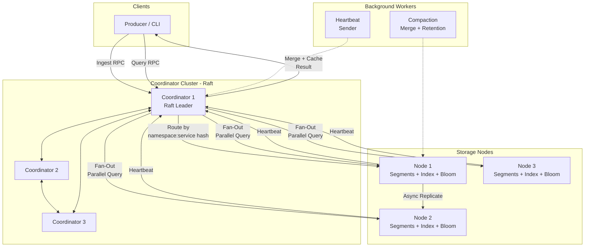

# Phase 8 — Stretch Goals and Resume Polish: Implementation Plan

> **For agentic workers:** REQUIRED SUB-SKILL: Use superpowers:subagent-driven-development (recommended) or superpowers:executing-plans to implement this plan task-by-task. Steps use checkbox (`- [ ]`) syntax for tracking.

**Goal:** Add namespace routing, a boolean query language, bloom filter pruning, compaction, query caching, and segment file transfer catch-up, then produce polished portfolio artifacts.

**Architecture:** Six independent features layered onto the existing multi-node engine without changing core storage or Raft coordination. Each feature is self-contained: proto changes are followed by buf generate, then Go implementation, then tests. Portfolio polish runs last.

**Tech Stack:** Go, gRPC/protobuf (buf), `github.com/bits-and-blooms/bloom/v3` (new), zap, Prometheus.

---

## File Map

### Feature 1 — Namespace Support
- Modify: `proto/logengine/v1/log_entry.proto` — add `namespace` field 8
- Modify: `proto/logengine/v1/query.proto` — rename `keyword` → `query_string` (field 1), add `namespace` field 7
- Modify: `pkg/types/log_entry.go` — add `Namespace string`
- Modify: `pkg/types/query.go` — rename `Keyword` → `QueryString`, add `Namespace string`
- Modify: `internal/ingest/convert.go` — propagate `Namespace`
- Modify: `internal/ingest/router.go` — hash `namespace + ":" + service`
- Modify: `internal/ingest/router_test.go` — update for new signature
- Modify: `internal/index/index.go` — add namespace index map, update `Add` and `Resolve`
- Modify: `internal/query/executor.go` — use `QueryString`, add namespace filter, call updated `Resolve`
- Modify: `internal/query/server.go` — map `query_string` and `namespace` from proto
- Modify: `internal/coordinator/fanout.go` — propagate `query_string` and `namespace`
- Create: `test/integration/phase8_namespace_test.go`

### Feature 2 — Expressive Query Language
- Create: `internal/query/parser.go` — AST types + recursive descent parser
- Create: `internal/query/parser_test.go`
- Modify: `internal/query/executor.go` — replace keyword matching with AST walker

### Feature 3 — Bloom Filters
- Create: `internal/storage/bloom.go` — `BuildBloom`, `WriteBloom`, `ReadBloom`, `BloomPath`
- Create: `internal/storage/bloom_test.go`
- Modify: `internal/storage/manager.go` — write sidecar on rotate, load blooms on startup, expose `BloomFor`
- Modify: `internal/query/executor.go` — bloom pruning before segment scan
- Create: `test/integration/phase8_bloom_test.go`

### Feature 4 — Compaction
- Modify: `internal/storage/manager.go` — add `ListClosedSegments`, `RemapSegment`, `DeleteSegment`, `LoadSegment`
- Create: `internal/storage/compaction.go` — `Compactor` with merge + retention passes
- Create: `internal/storage/compaction_test.go`
- Modify: `cmd/node/main.go` — start `Compactor`

### Feature 5 — Query Result Caching
- Create: `internal/coordinator/cache.go` — TTL + LRU cache
- Create: `internal/coordinator/cache_test.go`
- Modify: `internal/coordinator/fanout.go` — check cache before fan-out, store result after

### Feature 6 — Segment File Transfer Catch-Up
- Modify: `proto/logengine/v1/ingest.proto` — add `ListSegments` + `TransferSegment` RPCs
- Modify: `internal/ingest/server.go` — implement new handlers
- Modify: `internal/ingest/catchup.go` — file-transfer path before entry-level catch-up
- Create: `test/integration/phase8_catchup_test.go`

### Portfolio Polish
- Create: `docs/architecture/diagram.md` (Mermaid source)
- Rewrite: `README.md`
- Create: `test/bench/bloom_benchmark.sh`
- Create: `docs/benchmarks/bloom-filter-results.md`
- Create: `docs/planning/RESUME_BULLETS.md`
- Modify: `docs/planning/BACKLOG.md`

---

## Task 1: Add namespace to proto and regenerate

**Files:**
- Modify: `proto/logengine/v1/log_entry.proto`
- Modify: `proto/logengine/v1/query.proto`

- [ ] **Step 1: Update log_entry.proto**

```protobuf
// proto/logengine/v1/log_entry.proto — add field 8
message LogEntry {
  string id          = 1;
  int64  timestamp   = 2;
  int64  received_at = 3;
  string service     = 4;
  string level       = 5;
  string message     = 6;
  map<string, string> fields = 7;
  // Logical tenant or namespace for this log entry. Empty string means default namespace.
  string namespace   = 8;
}
```

- [ ] **Step 2: Update query.proto — rename keyword to query_string and add namespace**

```protobuf
// proto/logengine/v1/query.proto — full file replacement
syntax = "proto3";

package logengine.v1;

import "logengine/v1/log_entry.proto";

option go_package = "github.com/Weilei424/distributed-log-query-engine/internal/api/gen/logengine/v1;logengine";

service QueryService {
  rpc Query(QueryRequest) returns (QueryResponse);
}

message QueryRequest {
  // Boolean query string. Supports bare terms, field:value filters, AND/OR operators.
  // Empty means match-all. Replaces the old keyword field (same field number, wire-compatible rename).
  string query_string = 1;

  // Filter by service name. Empty means all services.
  string service = 2;

  // Lower bound of the time range (Unix nanoseconds). 0 means unbounded.
  int64 start_time = 3;

  // Upper bound of the time range (Unix nanoseconds). 0 means unbounded.
  int64 end_time = 4;

  // Maximum number of entries to return. 0 uses server default (100).
  int32 limit = 5;

  // Number of entries to skip for pagination.
  int32 offset = 6;

  // Filter by namespace. Empty means all namespaces.
  string namespace = 7;
}

message QueryResponse {
  repeated LogEntry entries = 1;
  // Lower-bound candidate count before offset/limit (see Architecture Notes Decision 7).
  int32 total   = 2;
  bool  partial = 3;
  int64 took_ms = 4;
}
```

- [ ] **Step 3: Regenerate Go bindings**

```bash
cd /mnt/d/projects/distributed-log-query-engine
buf generate
```

Expected: exits 0, updated files under `internal/api/gen/logengine/v1/`.

- [ ] **Step 4: Verify build still compiles (will have errors — note them)**

```bash
go build ./...
```

Expected: compile errors referencing `.Keyword` — that's the field we're about to rename. Note them; they'll be fixed in subsequent tasks.

---

## Task 2: Update Go types for namespace

**Files:**
- Modify: `pkg/types/log_entry.go`
- Modify: `pkg/types/query.go`

- [ ] **Step 1: Add Namespace to LogEntry**

```go
// pkg/types/log_entry.go
package types

// LogEntry represents a single log record in the system.
// Timestamp and ReceivedAt are Unix nanoseconds.
type LogEntry struct {
	ID         string
	Timestamp  int64
	ReceivedAt int64
	Namespace  string
	Service    string
	Level      string
	Message    string
	Fields     map[string]string
}
```

- [ ] **Step 2: Update QueryRequest — rename Keyword to QueryString, add Namespace**

```go
// pkg/types/query.go
package types

// QueryRequest describes the parameters for a local log query.
// StartTime and EndTime are Unix nanoseconds; zero means unbounded.
// Limit of zero uses the server default (100).
type QueryRequest struct {
	QueryString string
	Namespace   string
	Service     string
	StartTime   int64
	EndTime     int64
	Limit       int32
	Offset      int32
}

// QueryResult holds the output of a log query.
type QueryResult struct {
	Entries []*LogEntry
	Total   int32
	TookMs  int64
	Partial bool
}
```

---

## Task 3: Update ingest convert and router for namespace

**Files:**
- Modify: `internal/ingest/convert.go`
- Modify: `internal/ingest/router.go`
- Modify: `internal/ingest/router_test.go`

- [ ] **Step 1: Update ProtoToEntry and EntryToProto to propagate Namespace**

```go
// internal/ingest/convert.go
package ingest

import (
	"crypto/rand"
	"encoding/hex"
	"fmt"
	"time"

	logengine "github.com/Weilei424/distributed-log-query-engine/internal/api/gen/logengine/v1"
	"github.com/Weilei424/distributed-log-query-engine/pkg/types"
)

func ProtoToEntry(pb *logengine.LogEntry) *types.LogEntry {
	return &types.LogEntry{
		ID:         pb.Id,
		Timestamp:  pb.Timestamp,
		ReceivedAt: pb.ReceivedAt,
		Namespace:  pb.Namespace,
		Service:    pb.Service,
		Level:      pb.Level,
		Message:    pb.Message,
		Fields:     pb.Fields,
	}
}

func EntryToProto(e *types.LogEntry) *logengine.LogEntry {
	return &logengine.LogEntry{
		Id:         e.ID,
		Timestamp:  e.Timestamp,
		ReceivedAt: e.ReceivedAt,
		Namespace:  e.Namespace,
		Service:    e.Service,
		Level:      e.Level,
		Message:    e.Message,
		Fields:     e.Fields,
	}
}

func GenerateID() string {
	b := make([]byte, 8)
	if _, err := rand.Read(b); err != nil {
		return fmt.Sprintf("auto-%d", time.Now().UnixNano())
	}
	return "auto-" + hex.EncodeToString(b)
}
```

- [ ] **Step 2: Update ShardID to include namespace**

```go
// internal/ingest/router.go
package ingest

import "hash/fnv"

// ShardID computes the shard ID for a log entry based on its namespace and service.
// Uses FNV-1a hash of "namespace:service" modulo totalShards.
func ShardID(namespace, service string, totalShards int) int {
	if totalShards <= 0 {
		return 0
	}
	h := fnv.New32a()
	h.Write([]byte(namespace + ":" + service))
	return int(h.Sum32()) % totalShards
}
```

- [ ] **Step 3: Write the failing router test**

```go
// internal/ingest/router_test.go
package ingest

import (
	"testing"
)

func TestShardID_Deterministic(t *testing.T) {
	for i := 0; i < 10; i++ {
		if ShardID("ns1", "api", 8) != ShardID("ns1", "api", 8) {
			t.Fatal("ShardID not deterministic")
		}
	}
}

func TestShardID_NamespaceAffectsResult(t *testing.T) {
	a := ShardID("ns1", "api", 8)
	b := ShardID("ns2", "api", 8)
	if a == b {
		t.Skip("hash collision — acceptable but unusual")
	}
}

func TestShardID_ZeroShards(t *testing.T) {
	if ShardID("ns", "svc", 0) != 0 {
		t.Fatal("expected 0 for totalShards=0")
	}
}

func TestShardID_Range(t *testing.T) {
	for i := 0; i < 100; i++ {
		id := ShardID("", "svc", 8)
		if id < 0 || id >= 8 {
			t.Fatalf("ShardID out of range: %d", id)
		}
	}
}
```

- [ ] **Step 4: Run test**

```bash
go test ./internal/ingest/ -run TestShardID -v
```

Expected: all pass.

- [ ] **Step 5: Fix all call sites of ShardID that still pass two args**

Search and update: `internal/ingest/orchestrator.go`, `internal/ingest/catchup.go`, `internal/ingest/server.go` — anywhere `ShardID(` is called now needs a namespace argument. Pass `entry.Namespace` (or `""` where namespace is not available). Run `go build ./...` and fix each compile error.

- [ ] **Step 6: Run build**

```bash
go build ./...
```

Expected: exits 0.

---

## Task 4: Update index for namespace filtering

**Files:**
- Modify: `internal/index/index.go`

- [ ] **Step 1: Add namespaceSegments to Index and update Add**

Replace the `Index` struct and `Add` method:

```go
// Index struct — add namespaceSegments field
type Index struct {
	mu                 sync.RWMutex
	tokenSegments      map[string]map[string]struct{}
	serviceSegments    map[string]map[string]struct{}
	namespaceSegments  map[string]map[string]struct{}
	segmentMeta        map[string]SegmentMeta
}

func NewIndex() *Index {
	return &Index{
		tokenSegments:     make(map[string]map[string]struct{}),
		serviceSegments:   make(map[string]map[string]struct{}),
		namespaceSegments: make(map[string]map[string]struct{}),
		segmentMeta:       make(map[string]SegmentMeta),
	}
}

func (idx *Index) Add(entry *types.LogEntry, segmentPath string) {
	idx.mu.Lock()
	defer idx.mu.Unlock()

	for _, tok := range tokenize(entry.Message) {
		if idx.tokenSegments[tok] == nil {
			idx.tokenSegments[tok] = make(map[string]struct{})
		}
		idx.tokenSegments[tok][segmentPath] = struct{}{}
	}

	if entry.Service != "" {
		if idx.serviceSegments[entry.Service] == nil {
			idx.serviceSegments[entry.Service] = make(map[string]struct{})
		}
		idx.serviceSegments[entry.Service][segmentPath] = struct{}{}
	}

	ns := entry.Namespace
	if ns == "" {
		ns = ""
	}
	if idx.namespaceSegments[ns] == nil {
		idx.namespaceSegments[ns] = make(map[string]struct{})
	}
	idx.namespaceSegments[ns][segmentPath] = struct{}{}

	meta, ok := idx.segmentMeta[segmentPath]
	if !ok {
		meta = SegmentMeta{MinTime: entry.Timestamp, MaxTime: entry.Timestamp}
	} else {
		if entry.Timestamp < meta.MinTime {
			meta.MinTime = entry.Timestamp
		}
		if entry.Timestamp > meta.MaxTime {
			meta.MaxTime = entry.Timestamp
		}
	}
	idx.segmentMeta[segmentPath] = meta
}
```

- [ ] **Step 2: Update Resolve signature to accept namespace**

```go
// Resolve returns the sorted set of segment paths that may contain entries
// matching the given query string tokens, namespace, service, and time range.
func (idx *Index) Resolve(tokens []string, namespace, service string, startTime, endTime int64) []string {
	idx.mu.RLock()
	defer idx.mu.RUnlock()

	candidates := make(map[string]struct{})
	for path := range idx.segmentMeta {
		candidates[path] = struct{}{}
	}

	// Intersect by each required token.
	for _, tok := range tokens {
		segs, ok := idx.tokenSegments[tok]
		if !ok {
			return nil
		}
		for path := range candidates {
			if _, found := segs[path]; !found {
				delete(candidates, path)
			}
		}
		if len(candidates) == 0 {
			return nil
		}
	}

	// Intersect by namespace (non-empty only).
	if namespace != "" {
		segs, ok := idx.namespaceSegments[namespace]
		if !ok {
			return nil
		}
		for path := range candidates {
			if _, found := segs[path]; !found {
				delete(candidates, path)
			}
		}
	}

	// Intersect by service.
	if service != "" {
		segs, ok := idx.serviceSegments[service]
		if !ok {
			return nil
		}
		for path := range candidates {
			if _, found := segs[path]; !found {
				delete(candidates, path)
			}
		}
	}

	// Prune by time range.
	for path := range candidates {
		meta := idx.segmentMeta[path]
		if startTime > 0 && meta.MaxTime < startTime {
			delete(candidates, path)
			continue
		}
		if endTime > 0 && meta.MinTime > endTime {
			delete(candidates, path)
		}
	}

	paths := make([]string, 0, len(candidates))
	for path := range candidates {
		paths = append(paths, path)
	}
	sort.Strings(paths)
	return paths
}
```

- [ ] **Step 3: Update index_test.go to match new Resolve signature**

In `internal/index/index_test.go`, change all calls from `idx.Resolve(keyword, service, start, end)` to `idx.Resolve(tokenize(keyword), "", service, start, end)`. Run `go build ./internal/index/` to find all call sites.

```bash
go build ./internal/index/
```

Fix any compile errors.

- [ ] **Step 4: Run index tests**

```bash
go test ./internal/index/ -v
```

Expected: all pass.

---

## Task 5: Update executor, query server, and fanout for namespace + QueryString

**Files:**
- Modify: `internal/query/executor.go`
- Modify: `internal/query/server.go`
- Modify: `internal/coordinator/fanout.go`

- [ ] **Step 1: Update executor.go — use QueryString and Namespace**

Replace the `Execute` method body with namespace-aware logic. The `QueryString` is tokenized directly for now (AST parser comes in Task 7; for now treat it as a raw keyword string for backward compat):

```go
// internal/query/executor.go — replace Execute method
func (e *LocalExecutor) Execute(ctx context.Context, req *types.QueryRequest) (*types.QueryResult, error) {
	start := time.Now()

	if req.Limit < 0 {
		return nil, fmt.Errorf("limit must be non-negative")
	}
	if req.Limit == 0 {
		req.Limit = defaultLimit
	}
	if req.Offset < 0 {
		return nil, fmt.Errorf("offset must be non-negative")
	}
	if err := ctx.Err(); err != nil {
		return nil, fmt.Errorf("query canceled: %w", err)
	}

	// Tokenize query string for index lookup (AST-aware pruning added in Task 7).
	kwTokens := tokenize(req.QueryString)
	paths := e.index.Resolve(kwTokens, req.Namespace, req.Service, req.StartTime, req.EndTime)

	var raw []*types.LogEntry
	if len(paths) > 0 {
		if err := ctx.Err(); err != nil {
			return nil, fmt.Errorf("query canceled before disk read: %w", err)
		}
		var err error
		raw, err = e.manager.ReadSegments(paths)
		if err != nil {
			return nil, fmt.Errorf("execute query: %w", err)
		}
	}

	filtered := make([]*types.LogEntry, 0, len(raw))
	for _, entry := range raw {
		if req.Namespace != "" && entry.Namespace != req.Namespace {
			continue
		}
		if req.Service != "" && entry.Service != req.Service {
			continue
		}
		if len(kwTokens) > 0 {
			msgTokenSet := tokenSet(entry.Message)
			match := true
			for _, tok := range kwTokens {
				if _, found := msgTokenSet[tok]; !found {
					match = false
					break
				}
			}
			if !match {
				continue
			}
		}
		if req.StartTime > 0 && entry.Timestamp < req.StartTime {
			continue
		}
		if req.EndTime > 0 && entry.Timestamp > req.EndTime {
			continue
		}
		filtered = append(filtered, entry)
	}

	sort.Slice(filtered, func(i, j int) bool {
		if filtered[i].Timestamp != filtered[j].Timestamp {
			return filtered[i].Timestamp > filtered[j].Timestamp
		}
		return filtered[i].ID < filtered[j].ID
	})

	total := int32(len(filtered))
	offset := int(req.Offset)
	if offset > len(filtered) {
		offset = len(filtered)
	}
	filtered = filtered[offset:]
	limit := int(req.Limit)
	if limit > len(filtered) {
		limit = len(filtered)
	}
	filtered = filtered[:limit]

	return &types.QueryResult{
		Entries: filtered,
		Total:   total,
		TookMs:  time.Since(start).Milliseconds(),
	}, nil
}
```

- [ ] **Step 2: Update query/server.go — map QueryString and Namespace**

In `Query` method, replace the `typesReq` construction:

```go
typesReq := &types.QueryRequest{
    QueryString: req.QueryString,
    Namespace:   req.Namespace,
    Service:     req.Service,
    StartTime:   req.StartTime,
    EndTime:     req.EndTime,
    Limit:       req.Limit,
    Offset:      req.Offset,
}
```

Also update the logger call — replace `zap.String("keyword", req.Keyword)` with `zap.String("query_string", req.QueryString)`.

Also update the pbEntries loop to include `Namespace`:

```go
pbEntries[i] = &logengine.LogEntry{
    Id:         e.ID,
    Timestamp:  e.Timestamp,
    ReceivedAt: e.ReceivedAt,
    Namespace:  e.Namespace,
    Service:    e.Service,
    Level:      e.Level,
    Message:    e.Message,
    Fields:     e.Fields,
}
```

- [ ] **Step 3: Update fanout.go — propagate QueryString and Namespace**

Replace the `fanReq` construction in `Execute`:

```go
fanReq := &logengine.QueryRequest{
    QueryString: req.QueryString,
    Namespace:   req.Namespace,
    Service:     req.Service,
    StartTime:   req.StartTime,
    EndTime:     req.EndTime,
    Limit:       nodeLimit,
    Offset:      0,
}
```

Also update the entries loop to include `Namespace`:

```go
entries[i] = &types.LogEntry{
    ID:         pb.Id,
    Timestamp:  pb.Timestamp,
    ReceivedAt: pb.ReceivedAt,
    Namespace:  pb.Namespace,
    Service:    pb.Service,
    Level:      pb.Level,
    Message:    pb.Message,
    Fields:     pb.Fields,
}
```

- [ ] **Step 4: Fix remaining compile errors**

```bash
go build ./...
```

Fix any remaining references to `.Keyword` or old `Resolve` signatures.

- [ ] **Step 5: Run all existing tests**

```bash
go test ./... -count=1 -timeout 120s
```

Expected: all pass.

---

## Task 6: Integration test — namespace isolation

**Files:**
- Create: `test/integration/phase8_namespace_test.go`

- [ ] **Step 1: Write the test**

```go
// test/integration/phase8_namespace_test.go
package integration

import (
	"context"
	"testing"
	"time"

	"google.golang.org/grpc"
	"google.golang.org/grpc/credentials/insecure"

	logengine "github.com/Weilei424/distributed-log-query-engine/internal/api/gen/logengine/v1"
)

func TestNamespaceIsolation(t *testing.T) {
	// Reuse the single-node test helper from existing integration tests.
	addr := startTestNode(t)

	conn, err := grpc.NewClient(addr, grpc.WithTransportCredentials(insecure.NewCredentials()))
	if err != nil {
		t.Fatalf("dial: %v", err)
	}
	t.Cleanup(func() { conn.Close() })

	ingestClient := logengine.NewIngestServiceClient(conn)
	queryClient := logengine.NewQueryServiceClient(conn)

	ctx := context.Background()
	now := time.Now().UnixNano()

	// Ingest one entry per namespace.
	for _, ns := range []string{"team-alpha", "team-beta"} {
		_, err := ingestClient.Ingest(ctx, &logengine.IngestRequest{
			Entry: &logengine.LogEntry{
				Timestamp: now,
				Namespace: ns,
				Service:   "svc",
				Level:     "INFO",
				Message:   "hello from " + ns,
			},
		})
		if err != nil {
			t.Fatalf("ingest %s: %v", ns, err)
		}
	}

	// Query for team-alpha only.
	resp, err := queryClient.Query(ctx, &logengine.QueryRequest{
		Namespace: "team-alpha",
		Limit:     10,
	})
	if err != nil {
		t.Fatalf("query: %v", err)
	}
	if len(resp.Entries) != 1 {
		t.Fatalf("expected 1 entry for team-alpha, got %d", len(resp.Entries))
	}
	if resp.Entries[0].Namespace != "team-alpha" {
		t.Fatalf("wrong namespace: %s", resp.Entries[0].Namespace)
	}
}
```

- [ ] **Step 2: Run the test**

```bash
go test ./test/integration/ -run TestNamespaceIsolation -v -timeout 60s
```

Expected: PASS.

---

## Task 7: Boolean query language — parser

**Files:**
- Create: `internal/query/parser.go`
- Create: `internal/query/parser_test.go`

- [ ] **Step 1: Write failing parser tests**

```go
// internal/query/parser_test.go
package query

import (
	"testing"
)

func TestParse_BareTerm(t *testing.T) {
	node, err := Parse("error")
	if err != nil {
		t.Fatal(err)
	}
	n, ok := node.(TermNode)
	if !ok {
		t.Fatalf("expected TermNode, got %T", node)
	}
	if n.Token != "error" {
		t.Fatalf("want error, got %s", n.Token)
	}
}

func TestParse_FieldFilter(t *testing.T) {
	node, err := Parse("level:error")
	if err != nil {
		t.Fatal(err)
	}
	n, ok := node.(FieldNode)
	if !ok {
		t.Fatalf("expected FieldNode, got %T", node)
	}
	if n.Field != "level" || n.Value != "error" {
		t.Fatalf("want level:error, got %s:%s", n.Field, n.Value)
	}
}

func TestParse_And(t *testing.T) {
	node, err := Parse("error AND timeout")
	if err != nil {
		t.Fatal(err)
	}
	n, ok := node.(AndNode)
	if !ok {
		t.Fatalf("expected AndNode, got %T", node)
	}
	if _, ok := n.Left.(TermNode); !ok {
		t.Fatalf("expected TermNode left, got %T", n.Left)
	}
}

func TestParse_Or(t *testing.T) {
	node, err := Parse("error OR timeout")
	if err != nil {
		t.Fatal(err)
	}
	if _, ok := node.(OrNode); !ok {
		t.Fatalf("expected OrNode, got %T", node)
	}
}

func TestParse_AndBindsTighter(t *testing.T) {
	// "a OR b AND c" should parse as "a OR (b AND c)"
	node, err := Parse("a OR b AND c")
	if err != nil {
		t.Fatal(err)
	}
	or, ok := node.(OrNode)
	if !ok {
		t.Fatalf("top node should be OrNode, got %T", node)
	}
	if _, ok := or.Right.(AndNode); !ok {
		t.Fatalf("right of OR should be AndNode, got %T", or.Right)
	}
}

func TestParse_Grouping(t *testing.T) {
	node, err := Parse("(level:error OR level:warn) AND service:api")
	if err != nil {
		t.Fatal(err)
	}
	and, ok := node.(AndNode)
	if !ok {
		t.Fatalf("expected AndNode at root, got %T", node)
	}
	if _, ok := and.Left.(OrNode); !ok {
		t.Fatalf("expected OrNode left, got %T", and.Left)
	}
}

func TestParse_Empty(t *testing.T) {
	node, err := Parse("")
	if err != nil {
		t.Fatal(err)
	}
	if node != nil {
		t.Fatalf("empty string should return nil node, got %T", node)
	}
}

func TestParse_MalformedMissingOperand(t *testing.T) {
	_, err := Parse("AND error")
	if err == nil {
		t.Fatal("expected error for malformed input")
	}
}
```

- [ ] **Step 2: Run test — expect FAIL (parser not implemented)**

```bash
go test ./internal/query/ -run TestParse -v
```

Expected: compile error or FAIL.

- [ ] **Step 3: Implement parser.go**

```go
// internal/query/parser.go
package query

import (
	"fmt"
	"strings"
)

// Node is the interface implemented by all AST node types.
type Node interface{ node() }

// AndNode represents a logical AND of two sub-expressions.
type AndNode struct{ Left, Right Node }

// OrNode represents a logical OR of two sub-expressions.
type OrNode struct{ Left, Right Node }

// TermNode represents a bare keyword term matched against the log message.
type TermNode struct{ Token string }

// FieldNode represents a field:value filter (e.g. level:error).
type FieldNode struct{ Field, Value string }

func (AndNode) node()  {}
func (OrNode) node()   {}
func (TermNode) node() {}
func (FieldNode) node() {}

// Parse parses a boolean query string into a Node AST.
// Returns nil, nil for an empty query string.
// Grammar:
//   query    = or_expr
//   or_expr  = and_expr ( "OR" and_expr )*
//   and_expr = atom ( "AND" atom )*
//   atom     = "(" or_expr ")" | field_term | bare_term
//   field_term = IDENT ":" IDENT
//   bare_term  = IDENT
func Parse(query string) (Node, error) {
	query = strings.TrimSpace(query)
	if query == "" {
		return nil, nil
	}
	p := &queryParser{tokens: lex(query)}
	node, err := p.parseOr()
	if err != nil {
		return nil, err
	}
	if p.pos < len(p.tokens) {
		return nil, fmt.Errorf("unexpected token %q at position %d", p.tokens[p.pos], p.pos)
	}
	return node, nil
}

type queryParser struct {
	tokens []string
	pos    int
}

func (p *queryParser) peek() string {
	if p.pos >= len(p.tokens) {
		return ""
	}
	return p.tokens[p.pos]
}

func (p *queryParser) consume() string {
	t := p.tokens[p.pos]
	p.pos++
	return t
}

func (p *queryParser) parseOr() (Node, error) {
	left, err := p.parseAnd()
	if err != nil {
		return nil, err
	}
	for p.peek() == "OR" {
		p.consume()
		right, err := p.parseAnd()
		if err != nil {
			return nil, err
		}
		left = OrNode{Left: left, Right: right}
	}
	return left, nil
}

func (p *queryParser) parseAnd() (Node, error) {
	left, err := p.parseAtom()
	if err != nil {
		return nil, err
	}
	for p.peek() == "AND" {
		p.consume()
		right, err := p.parseAtom()
		if err != nil {
			return nil, err
		}
		left = AndNode{Left: left, Right: right}
	}
	return left, nil
}

func (p *queryParser) parseAtom() (Node, error) {
	tok := p.peek()
	if tok == "" {
		return nil, fmt.Errorf("unexpected end of query")
	}
	if tok == "AND" || tok == "OR" {
		return nil, fmt.Errorf("unexpected operator %q", tok)
	}
	if tok == "(" {
		p.consume()
		node, err := p.parseOr()
		if err != nil {
			return nil, err
		}
		if p.peek() != ")" {
			return nil, fmt.Errorf("expected closing ')'")
		}
		p.consume()
		return node, nil
	}
	p.consume()
	if strings.Contains(tok, ":") {
		parts := strings.SplitN(tok, ":", 2)
		return FieldNode{Field: parts[0], Value: parts[1]}, nil
	}
	return TermNode{Token: strings.ToLower(tok)}, nil
}

// lex splits a query string into tokens, treating parentheses as standalone tokens.
func lex(query string) []string {
	var tokens []string
	query = strings.ReplaceAll(query, "(", " ( ")
	query = strings.ReplaceAll(query, ")", " ) ")
	for _, f := range strings.Fields(query) {
		if f != "" {
			tokens = append(tokens, f)
		}
	}
	return tokens
}
```

- [ ] **Step 4: Run parser tests**

```bash
go test ./internal/query/ -run TestParse -v
```

Expected: all pass.

---

## Task 8: Wire AST into executor

**Files:**
- Modify: `internal/query/executor.go`

- [ ] **Step 1: Add AST matching helpers to executor.go**

Add these functions after the existing `tokenSet` function:

```go
// matchesNode evaluates whether entry matches the AST node.
func matchesNode(entry *types.LogEntry, node Node) bool {
	if node == nil {
		return true
	}
	switch n := node.(type) {
	case AndNode:
		return matchesNode(entry, n.Left) && matchesNode(entry, n.Right)
	case OrNode:
		return matchesNode(entry, n.Left) || matchesNode(entry, n.Right)
	case TermNode:
		return tokenSet(entry.Message)[n.Token]
	case FieldNode:
		return matchField(entry, n.Field, n.Value)
	}
	return false
}

func matchField(entry *types.LogEntry, field, value string) bool {
	switch strings.ToLower(field) {
	case "level":
		return strings.EqualFold(entry.Level, value)
	case "service":
		return entry.Service == value
	case "namespace":
		return entry.Namespace == value
	case "message":
		return tokenSet(entry.Message)[strings.ToLower(value)]
	default:
		return entry.Fields[field] == value
	}
}
```

- [ ] **Step 2: Update Execute to parse and use AST**

In `Execute`, replace the keyword tokenization and filtering block:

```go
// Parse the query string into an AST once.
ast, err := Parse(req.QueryString)
if err != nil {
    return nil, fmt.Errorf("parse query: %w", err)
}

// For index resolution, extract bare tokens from TermNodes only (conservative — avoids missing segments).
var indexTokens []string
if ast != nil {
    indexTokens = collectTermTokens(ast)
}
paths := e.index.Resolve(indexTokens, req.Namespace, req.Service, req.StartTime, req.EndTime)
```

And replace the per-entry filtering block with:

```go
for _, entry := range raw {
    if req.Namespace != "" && entry.Namespace != req.Namespace {
        continue
    }
    if req.Service != "" && entry.Service != req.Service {
        continue
    }
    if !matchesNode(entry, ast) {
        continue
    }
    if req.StartTime > 0 && entry.Timestamp < req.StartTime {
        continue
    }
    if req.EndTime > 0 && entry.Timestamp > req.EndTime {
        continue
    }
    filtered = append(filtered, entry)
}
```

- [ ] **Step 3: Add collectTermTokens helper**

```go
// collectTermTokens extracts all TermNode tokens from the AST for index lookup.
// This is conservative: it only returns tokens that must appear in matching entries.
// For OR nodes, no tokens are returned (either branch might match).
func collectTermTokens(node Node) []string {
	if node == nil {
		return nil
	}
	switch n := node.(type) {
	case AndNode:
		left := collectTermTokens(n.Left)
		right := collectTermTokens(n.Right)
		return append(left, right...)
	case OrNode:
		return nil // conservative: can't require either side
	case TermNode:
		return []string{n.Token}
	case FieldNode:
		return nil // field filters are applied post-scan
	}
	return nil
}
```

- [ ] **Step 4: Remove old kwTokens variable** — the earlier tokenize(req.QueryString) line is now replaced. Remove any remaining references to `kwTokens`.

- [ ] **Step 5: Run all tests**

```bash
go test ./... -count=1 -timeout 120s
```

Expected: all pass.

---

## Task 9: Bloom filter — core library

**Files:**
- Create: `internal/storage/bloom.go`
- Create: `internal/storage/bloom_test.go`

- [ ] **Step 1: Add bloom dependency**

```bash
cd /mnt/d/projects/distributed-log-query-engine
go get github.com/bits-and-blooms/bloom/v3
go mod tidy
```

- [ ] **Step 2: Write failing bloom tests**

```go
// internal/storage/bloom_test.go
package storage

import (
	"os"
	"path/filepath"
	"testing"
)

func TestBloomRoundTrip(t *testing.T) {
	tokens := []string{"error", "timeout", "service", "api"}
	bf := BuildBloom(tokens, 1000)
	for _, tok := range tokens {
		if !bf.TestString(tok) {
			t.Fatalf("bloom should contain %q", tok)
		}
	}
	if bf.TestString("definitely-not-present-xyz") {
		t.Log("false positive (acceptable)")
	}

	dir := t.TempDir()
	path := filepath.Join(dir, "test.bloom")
	if err := WriteBloom(path, bf); err != nil {
		t.Fatalf("WriteBloom: %v", err)
	}

	bf2, err := ReadBloom(path)
	if err != nil {
		t.Fatalf("ReadBloom: %v", err)
	}
	for _, tok := range tokens {
		if !bf2.TestString(tok) {
			t.Fatalf("after round-trip: bloom should contain %q", tok)
		}
	}
}

func TestBloomPath(t *testing.T) {
	got := BloomPath("/data/00000000000000000001.seg")
	want := "/data/00000000000000000001.bloom"
	if got != want {
		t.Fatalf("want %s, got %s", want, got)
	}
}

func TestReadBloom_MissingFile(t *testing.T) {
	_, err := ReadBloom("/nonexistent/path.bloom")
	if err == nil {
		t.Fatal("expected error for missing file")
	}
}

func TestWriteBloom_CreatesFile(t *testing.T) {
	dir := t.TempDir()
	path := filepath.Join(dir, "out.bloom")
	bf := BuildBloom([]string{"hello"}, 100)
	if err := WriteBloom(path, bf); err != nil {
		t.Fatal(err)
	}
	if _, err := os.Stat(path); err != nil {
		t.Fatalf("file not created: %v", err)
	}
}
```

- [ ] **Step 3: Run tests — expect FAIL**

```bash
go test ./internal/storage/ -run TestBloom -v
```

Expected: compile error.

- [ ] **Step 4: Implement bloom.go**

```go
// internal/storage/bloom.go
package storage

import (
	"fmt"
	"os"
	"strings"

	"github.com/bits-and-blooms/bloom/v3"
)

// BuildBloom creates a bloom filter from the given token slice.
// expectedN is the estimated total number of distinct tokens for sizing.
func BuildBloom(tokens []string, expectedN uint) *bloom.BloomFilter {
	if expectedN < 100 {
		expectedN = 100
	}
	bf := bloom.NewWithEstimates(expectedN, 0.01) // 1% FP rate
	for _, tok := range tokens {
		bf.AddString(strings.ToLower(tok))
	}
	return bf
}

// WriteBloom serializes bf to path atomically (write to .tmp, rename).
func WriteBloom(path string, bf *bloom.BloomFilter) error {
	tmp := path + ".tmp"
	f, err := os.Create(tmp)
	if err != nil {
		return fmt.Errorf("create bloom tmp %s: %w", tmp, err)
	}
	if _, err := bf.WriteTo(f); err != nil {
		f.Close()
		os.Remove(tmp)
		return fmt.Errorf("write bloom %s: %w", path, err)
	}
	if err := f.Sync(); err != nil {
		f.Close()
		os.Remove(tmp)
		return fmt.Errorf("sync bloom %s: %w", path, err)
	}
	f.Close()
	if err := os.Rename(tmp, path); err != nil {
		os.Remove(tmp)
		return fmt.Errorf("rename bloom %s: %w", path, err)
	}
	return nil
}

// ReadBloom deserializes a bloom filter from path.
func ReadBloom(path string) (*bloom.BloomFilter, error) {
	f, err := os.Open(path)
	if err != nil {
		return nil, fmt.Errorf("open bloom %s: %w", path, err)
	}
	defer f.Close()
	bf := &bloom.BloomFilter{}
	if _, err := bf.ReadFrom(f); err != nil {
		return nil, fmt.Errorf("read bloom %s: %w", path, err)
	}
	return bf, nil
}

// BloomPath returns the sidecar bloom path for a given segment path.
// e.g. "/data/00000000000000000001.seg" → "/data/00000000000000000001.bloom"
func BloomPath(segPath string) string {
	return strings.TrimSuffix(segPath, ".seg") + ".bloom"
}
```

- [ ] **Step 5: Run bloom tests**

```bash
go test ./internal/storage/ -run TestBloom -v
```

Expected: all pass.

---

## Task 10: Integrate bloom into storage manager and executor

**Files:**
- Modify: `internal/storage/manager.go`
- Modify: `internal/query/executor.go`

- [ ] **Step 1: Add bloom fields and BLOOM_ENABLED env check to manager**

Add to Manager struct:

```go
type Manager struct {
	mu              sync.Mutex
	dir             string
	maxSegmentBytes int64
	active          *Segment
	nextSeq         uint64
	paths           []string
	nodeID          string
	bloomEnabled    bool
	blooms          map[string]*bloom.BloomFilter // segPath → bloom
}
```

Import: `github.com/bits-and-blooms/bloom/v3` and `os`.

Update `NewManager` to read env and load existing sidecars:

```go
bloomEnabled := os.Getenv("BLOOM_ENABLED") == "true"
m := &Manager{
    dir:             dir,
    maxSegmentBytes: maxSegmentBytes,
    paths:           matches,
    nextSeq:         nextSeq,
    bloomEnabled:    bloomEnabled,
    blooms:          make(map[string]*bloom.BloomFilter),
}
// ... existing opts loop ...

// Load existing bloom sidecars for closed segments.
if bloomEnabled {
    closedPaths := matches
    if len(closedPaths) > 0 {
        closedPaths = closedPaths[:len(closedPaths)-1] // exclude active
    }
    for _, p := range closedPaths {
        bp := BloomPath(p)
        if bf, err := ReadBloom(bp); err == nil {
            m.blooms[p] = bf
        }
    }
}
```

- [ ] **Step 2: Write bloom sidecar on rotation**

In `rotate()`, after `m.active.Close()`, add:

```go
if m.bloomEnabled {
    closingPath := m.paths[len(m.paths)-1]
    if entries, err := ReadSegment(closingPath); err == nil {
        var tokens []string
        for _, e := range entries {
            tokens = append(tokens, tokenizeEntry(e)...)
        }
        bf := BuildBloom(tokens, uint(len(tokens)))
        _ = WriteBloom(BloomPath(closingPath), bf)
        m.blooms[closingPath] = bf
    }
}
```

Add helper (in bloom.go or manager.go):

```go
// tokenizeEntry extracts indexable tokens from a LogEntry for bloom filter population.
func tokenizeEntry(e *types.LogEntry) []string {
	var out []string
	// Message tokens
	lower := strings.ToLower(e.Message)
	for _, tok := range nonAlphanumericRe.Split(lower, -1) {
		if tok != "" {
			out = append(out, tok)
		}
	}
	// Structured field values
	out = append(out, strings.ToLower(e.Level))
	out = append(out, strings.ToLower(e.Service))
	out = append(out, strings.ToLower(e.Namespace))
	return out
}
```

Note: `nonAlphanumericRe` must be defined in the storage package. Add:

```go
import "regexp"
var nonAlphanumericRe = regexp.MustCompile(`[^a-z0-9]+`)
```

- [ ] **Step 3: Expose BloomFor method on Manager**

```go
// BloomFor returns the bloom filter for the given segment path, or nil if not loaded.
func (m *Manager) BloomFor(segPath string) *bloom.BloomFilter {
	m.mu.Lock()
	defer m.mu.Unlock()
	return m.blooms[segPath]
}
```

- [ ] **Step 4: Update LocalExecutor to accept bloom-aware manager and prune segments**

Update `NewLocalExecutor` — no signature change needed since `*storage.Manager` already has `BloomFor`.

In `Execute`, replace the `paths` → segment scan section to add bloom pruning:

```go
// Bloom-prune segments before reading.
prunedPaths := paths[:0:len(paths)]
for _, p := range paths {
    if bf := e.manager.BloomFor(p); bf != nil && ast != nil {
        if bloomDefiniteMiss(bf, ast) {
            continue
        }
    }
    prunedPaths = append(prunedPaths, p)
}

var raw []*types.LogEntry
if len(prunedPaths) > 0 {
    if err := ctx.Err(); err != nil {
        return nil, fmt.Errorf("query canceled before disk read: %w", err)
    }
    raw, err = e.manager.ReadSegments(prunedPaths)
    // ...
}
```

Add `bloomDefiniteMiss`:

```go
// bloomDefiniteMiss returns true when the bloom filter guarantees no entry
// in this segment can match the AST. Only AND-required TermNodes are checked;
// OR nodes are conservative (never skip).
func bloomDefiniteMiss(bf *bloom.BloomFilter, node Node) bool {
	switch n := node.(type) {
	case AndNode:
		return bloomDefiniteMiss(bf, n.Left) || bloomDefiniteMiss(bf, n.Right)
	case OrNode:
		return false // conservative
	case TermNode:
		return !bf.TestString(n.Token)
	case FieldNode:
		return !bf.TestString(strings.ToLower(n.Value))
	}
	return false
}
```

- [ ] **Step 5: Build and test**

```bash
go build ./...
go test ./... -count=1 -timeout 120s
```

Expected: all pass.

---

## Task 11: Integration test for bloom filter

**Files:**
- Create: `test/integration/phase8_bloom_test.go`

- [ ] **Step 1: Write the test**

```go
// test/integration/phase8_bloom_test.go
package integration

import (
	"context"
	"os"
	"testing"
	"time"

	"google.golang.org/grpc"
	"google.golang.org/grpc/credentials/insecure"

	logengine "github.com/Weilei424/distributed-log-query-engine/internal/api/gen/logengine/v1"
)

func TestBloomFilter_CorrectResultsWithBloomEnabled(t *testing.T) {
	os.Setenv("BLOOM_ENABLED", "true")
	t.Cleanup(func() { os.Unsetenv("BLOOM_ENABLED") })

	addr := startTestNode(t)
	conn, _ := grpc.NewClient(addr, grpc.WithTransportCredentials(insecure.NewCredentials()))
	t.Cleanup(func() { conn.Close() })

	ingest := logengine.NewIngestServiceClient(conn)
	qc := logengine.NewQueryServiceClient(conn)
	ctx := context.Background()
	now := time.Now().UnixNano()

	_, err := ingest.Ingest(ctx, &logengine.IngestRequest{Entry: &logengine.LogEntry{
		Timestamp: now, Service: "svc", Level: "ERROR", Message: "database connection failed",
	}})
	if err != nil {
		t.Fatal(err)
	}

	resp, err := qc.Query(ctx, &logengine.QueryRequest{QueryString: "database", Limit: 10})
	if err != nil {
		t.Fatal(err)
	}
	if len(resp.Entries) != 1 {
		t.Fatalf("expected 1 entry, got %d", len(resp.Entries))
	}
}
```

- [ ] **Step 2: Run**

```bash
go test ./test/integration/ -run TestBloomFilter -v -timeout 60s
```

Expected: PASS.

---

## Task 12: Storage manager — compaction helpers

**Files:**
- Modify: `internal/storage/manager.go`

- [ ] **Step 1: Add ListClosedSegments, RemapSegment, DeleteSegment, LoadSegment**

Add these methods to Manager (all acquire the mutex):

```go
// ListClosedSegments returns paths of all segments except the active one.
func (m *Manager) ListClosedSegments() []string {
	m.mu.Lock()
	defer m.mu.Unlock()
	if len(m.paths) <= 1 {
		return nil
	}
	out := make([]string, len(m.paths)-1)
	copy(out, m.paths[:len(m.paths)-1])
	return out
}

// RemapSegment replaces oldPath with newPath in the manager's path list.
// Also remaps any bloom entry. Used by compaction after merging segments.
func (m *Manager) RemapSegment(oldPath, newPath string) {
	m.mu.Lock()
	defer m.mu.Unlock()
	for i, p := range m.paths {
		if p == oldPath {
			m.paths[i] = newPath
		}
	}
	if bf, ok := m.blooms[oldPath]; ok {
		m.blooms[newPath] = bf
		delete(m.blooms, oldPath)
	}
}

// DeleteSegment removes path from the manager's path list and bloom map.
// Does NOT delete the file from disk — caller is responsible.
func (m *Manager) DeleteSegment(path string) {
	m.mu.Lock()
	defer m.mu.Unlock()
	out := m.paths[:0]
	for _, p := range m.paths {
		if p != path {
			out = append(out, p)
		}
	}
	m.paths = out
	delete(m.blooms, path)
}

// LoadSegment registers a newly transferred segment file with the manager.
// The segment must already exist on disk. Used by catch-up after file transfer.
func (m *Manager) LoadSegment(path string) error {
	m.mu.Lock()
	defer m.mu.Unlock()
	// Insert before the active segment (last element).
	active := m.paths[len(m.paths)-1]
	rest := m.paths[:len(m.paths)-1]
	rest = append(rest, path)
	m.paths = append(rest, active)

	if m.bloomEnabled {
		bp := BloomPath(path)
		if bf, err := ReadBloom(bp); err == nil {
			m.blooms[path] = bf
		}
	}
	return nil
}
```

- [ ] **Step 2: Build**

```bash
go build ./internal/storage/
```

Expected: exits 0.

---

## Task 13: Compaction worker

**Files:**
- Create: `internal/storage/compaction.go`
- Create: `internal/storage/compaction_test.go`

- [ ] **Step 1: Write failing compaction tests**

```go
// internal/storage/compaction_test.go
package storage

import (
	"os"
	"path/filepath"
	"testing"
	"time"

	"github.com/Weilei424/distributed-log-query-engine/pkg/types"
)

func makeTestManager(t *testing.T, maxBytes int64) *Manager {
	t.Helper()
	dir := t.TempDir()
	m, err := NewManager(dir, maxBytes)
	if err != nil {
		t.Fatalf("NewManager: %v", err)
	}
	t.Cleanup(func() { m.Close() })
	return m
}

func TestCompactor_MergePass(t *testing.T) {
	// Force tiny 1-byte segments so every entry causes a rotation.
	m := makeTestManager(t, 1)
	now := time.Now().UnixNano()

	entries := []*types.LogEntry{
		{ID: "a", Timestamp: now, Service: "svc", Level: "INFO", Message: "alpha"},
		{ID: "b", Timestamp: now + 1, Service: "svc", Level: "INFO", Message: "beta"},
		{ID: "c", Timestamp: now + 2, Service: "svc", Level: "INFO", Message: "gamma"},
	}
	for _, e := range entries {
		if err := m.Append(e); err != nil {
			t.Fatal(err)
		}
	}

	closedBefore := len(m.ListClosedSegments())
	if closedBefore < 2 {
		t.Fatalf("expected at least 2 closed segments, got %d", closedBefore)
	}

	c := NewCompactor(m, CompactorConfig{
		MergeThresholdBytes: 10 * 1024 * 1024, // everything qualifies
		RetentionDays:       0,                  // disabled
		IntervalSeconds:     0,                  // manual trigger only
	})
	c.runMergePass()

	closedAfter := len(m.ListClosedSegments())
	if closedAfter >= closedBefore {
		t.Fatalf("expected fewer segments after merge, got %d (was %d)", closedAfter, closedBefore)
	}

	// Verify all entries still readable.
	all, err := m.ReadSegments(m.SegmentPaths())
	if err != nil {
		t.Fatal(err)
	}
	if len(all) < len(entries) {
		t.Fatalf("expected %d entries after merge, got %d", len(entries), len(all))
	}
}

func TestCompactor_RetentionPass(t *testing.T) {
	m := makeTestManager(t, 1)
	oldNs := time.Now().Add(-10 * 24 * time.Hour).UnixNano()

	old := &types.LogEntry{ID: "old", Timestamp: oldNs, Service: "svc", Level: "INFO", Message: "old"}
	fresh := &types.LogEntry{ID: "fresh", Timestamp: time.Now().UnixNano(), Service: "svc", Level: "INFO", Message: "fresh"}

	if err := m.Append(old); err != nil {
		t.Fatal(err)
	}
	if err := m.Append(fresh); err != nil {
		t.Fatal(err)
	}

	c := NewCompactor(m, CompactorConfig{
		MergeThresholdBytes: 0, // disabled
		RetentionDays:       7,
		IntervalSeconds:     0,
	})
	c.runRetentionPass()

	all, err := m.ReadSegments(m.SegmentPaths())
	if err != nil {
		t.Fatal(err)
	}
	for _, e := range all {
		if e.ID == "old" {
			t.Fatal("old entry should have been deleted by retention pass")
		}
	}
}

func TestCompactor_RetentionDisabled(t *testing.T) {
	m := makeTestManager(t, 1)
	oldNs := time.Now().Add(-30 * 24 * time.Hour).UnixNano()
	if err := m.Append(&types.LogEntry{ID: "x", Timestamp: oldNs, Service: "s", Message: "m"}); err != nil {
		t.Fatal(err)
	}

	c := NewCompactor(m, CompactorConfig{RetentionDays: 0})
	c.runRetentionPass()

	all, _ := m.ReadSegments(m.SegmentPaths())
	found := false
	for _, e := range all {
		if e.ID == "x" {
			found = true
		}
	}
	if !found {
		t.Fatal("entry should not be deleted when RetentionDays=0")
	}
}
```

- [ ] **Step 2: Run test — expect compile error**

```bash
go test ./internal/storage/ -run TestCompactor -v
```

- [ ] **Step 3: Implement compaction.go**

```go
// internal/storage/compaction.go
package storage

import (
	"context"
	"fmt"
	"os"
	"path/filepath"
	"strings"
	"time"

	"github.com/Weilei424/distributed-log-query-engine/internal/index"
	"github.com/Weilei424/distributed-log-query-engine/pkg/types"
)

// CompactorConfig controls compaction behavior.
type CompactorConfig struct {
	// MergeThresholdBytes: segments smaller than this are eligible for merging.
	// 0 disables merging.
	MergeThresholdBytes int64
	// RetentionDays: segments whose newest entry is older than this many days are deleted.
	// 0 disables retention.
	RetentionDays int
	// IntervalSeconds: how often to run both passes. 0 means manual-trigger only (for tests).
	IntervalSeconds int
}

// DefaultCompactorConfig returns sane production defaults.
func DefaultCompactorConfig() CompactorConfig {
	return CompactorConfig{
		MergeThresholdBytes: 32 * 1024 * 1024, // 32MB
		RetentionDays:       7,
		IntervalSeconds:     300,
	}
}

// Compactor runs merge and retention passes over closed segments on a configurable interval.
type Compactor struct {
	manager *Manager
	idx     *index.Index // may be nil if index updates are not needed
	cfg     CompactorConfig
}

// NewCompactor creates a Compactor. idx may be nil if caller does not need index updates.
func NewCompactor(manager *Manager, cfg CompactorConfig) *Compactor {
	return &Compactor{manager: manager, cfg: cfg}
}

// NewCompactorWithIndex creates a Compactor that also updates idx on merge/delete.
func NewCompactorWithIndex(manager *Manager, idx *index.Index, cfg CompactorConfig) *Compactor {
	return &Compactor{manager: manager, idx: idx, cfg: cfg}
}

// Start runs both passes on the configured interval until ctx is canceled.
func (c *Compactor) Start(ctx context.Context) {
	if c.cfg.IntervalSeconds <= 0 {
		return
	}
	ticker := time.NewTicker(time.Duration(c.cfg.IntervalSeconds) * time.Second)
	defer ticker.Stop()
	for {
		select {
		case <-ctx.Done():
			return
		case <-ticker.C:
			c.runMergePass()
			c.runRetentionPass()
		}
	}
}

// runMergePass merges contiguous runs of small closed segments.
func (c *Compactor) runMergePass() {
	if c.cfg.MergeThresholdBytes <= 0 {
		return
	}
	closed := c.manager.ListClosedSegments()
	if len(closed) < 2 {
		return
	}

	// Find runs of eligible segments.
	var run []string
	flush := func() {
		if len(run) >= 2 {
			c.mergeRun(run)
		}
		run = nil
	}

	for _, path := range closed {
		info, err := os.Stat(path)
		if err != nil {
			flush()
			continue
		}
		if info.Size() < c.cfg.MergeThresholdBytes {
			run = append(run, path)
		} else {
			flush()
		}
	}
	flush()
}

func (c *Compactor) mergeRun(paths []string) {
	// Read all entries from the run.
	all, err := c.manager.ReadSegments(paths)
	if err != nil {
		return
	}

	// Write to a new segment file in the same directory.
	dir := filepath.Dir(paths[0])
	newPath := filepath.Join(dir, fmt.Sprintf("compacted-%d.seg", time.Now().UnixNano()))
	seg, err := OpenSegment(newPath)
	if err != nil {
		return
	}

	var tokens []string
	for _, e := range all {
		pb, err := marshalEntry(e)
		if err != nil {
			seg.Close()
			os.Remove(newPath)
			return
		}
		if err := seg.Append(pb); err != nil {
			seg.Close()
			os.Remove(newPath)
			return
		}
		if c.manager.bloomEnabled {
			tokens = append(tokens, tokenizeEntry(e)...)
		}
	}
	seg.Close()

	// Write merged bloom sidecar.
	if c.manager.bloomEnabled && len(tokens) > 0 {
		bf := BuildBloom(tokens, uint(len(tokens)))
		_ = WriteBloom(BloomPath(newPath), bf)
	}

	// Register new segment and deregister old ones.
	c.manager.mu.Lock()
	// Insert new path before active segment.
	active := c.manager.paths[len(c.manager.paths)-1]
	var kept []string
	for _, p := range c.manager.paths[:len(c.manager.paths)-1] {
		skip := false
		for _, op := range paths {
			if p == op {
				skip = true
				break
			}
		}
		if !skip {
			kept = append(kept, p)
		}
	}
	kept = append(kept, newPath)
	c.manager.paths = append(kept, active)
	if c.manager.bloomEnabled {
		bp := BloomPath(newPath)
		if bf, err := ReadBloom(bp); err == nil {
			c.manager.blooms[newPath] = bf
		}
		for _, op := range paths {
			delete(c.manager.blooms, op)
		}
	}
	c.manager.mu.Unlock()

	// Delete old segment files and their bloom sidecars.
	for _, op := range paths {
		os.Remove(op)
		os.Remove(BloomPath(op))
	}

	// Update index if available.
	if c.idx != nil {
		for _, e := range all {
			c.idx.Add(e, newPath)
		}
	}
}

// runRetentionPass deletes segments older than RetentionDays.
func (c *Compactor) runRetentionPass() {
	if c.cfg.RetentionDays <= 0 {
		return
	}
	cutoff := time.Now().Add(-time.Duration(c.cfg.RetentionDays) * 24 * time.Hour).UnixNano()
	closed := c.manager.ListClosedSegments()
	for _, path := range closed {
		entries, err := c.manager.ReadSegments([]string{path})
		if err != nil {
			continue
		}
		maxTS := int64(0)
		for _, e := range entries {
			if e.Timestamp > maxTS {
				maxTS = e.Timestamp
			}
		}
		if maxTS > 0 && maxTS < cutoff {
			c.manager.DeleteSegment(path)
			os.Remove(path)
			os.Remove(BloomPath(path))
		}
	}
}

// marshalEntry serializes a LogEntry to protobuf bytes for segment writing.
// Reuses the storage package's existing proto import.
func marshalEntry(e *types.LogEntry) ([]byte, error) {
	return marshalLogEntry(e)
}
```

Note: `marshalLogEntry` must be added to `manager.go` to expose the existing proto marshaling logic. Add:

```go
// marshalLogEntry serializes e to protobuf bytes. Used by compaction.
func marshalLogEntry(e *types.LogEntry) ([]byte, error) {
	pb := &logengine.LogEntry{
		Id:         e.ID,
		Timestamp:  e.Timestamp,
		ReceivedAt: e.ReceivedAt,
		Namespace:  e.Namespace,
		Service:    e.Service,
		Level:      e.Level,
		Message:    e.Message,
		Fields:     e.Fields,
	}
	data, err := proto.Marshal(pb)
	if err != nil {
		return nil, fmt.Errorf("marshal log entry: %w", err)
	}
	return data, nil
}
```

- [ ] **Step 4: Run compaction tests**

```bash
go test ./internal/storage/ -run TestCompactor -v -timeout 30s
```

Expected: all pass.

- [ ] **Step 5: Wire Compactor into node startup**

In `cmd/node/main.go`, after the index rebuild and before `grpcServer.Serve`, add:

```go
compactCfg := storage.DefaultCompactorConfig()
if v := os.Getenv("COMPACT_MERGE_THRESHOLD_BYTES"); v != "" {
    if n, err := strconv.ParseInt(v, 10, 64); err == nil {
        compactCfg.MergeThresholdBytes = n
    }
}
if v := os.Getenv("COMPACT_RETENTION_DAYS"); v != "" {
    if n, err := strconv.Atoi(v); err == nil {
        compactCfg.RetentionDays = n
    }
}
if v := os.Getenv("COMPACT_INTERVAL_SECONDS"); v != "" {
    if n, err := strconv.Atoi(v); err == nil {
        compactCfg.IntervalSeconds = n
    }
}
compactor := storage.NewCompactorWithIndex(mgr, idx, compactCfg)
go compactor.Start(ctx)
```

- [ ] **Step 6: Build and test**

```bash
go build ./...
go test ./... -count=1 -timeout 120s
```

Expected: all pass.

---

## Task 14: Query result cache

**Files:**
- Create: `internal/coordinator/cache.go`
- Create: `internal/coordinator/cache_test.go`

- [ ] **Step 1: Write failing cache tests**

```go
// internal/coordinator/cache_test.go
package coordinator

import (
	"testing"
	"time"

	"github.com/Weilei424/distributed-log-query-engine/pkg/types"
)

func makeResult(n int) *types.QueryResult {
	entries := make([]*types.LogEntry, n)
	for i := range entries {
		entries[i] = &types.LogEntry{ID: "x"}
	}
	return &types.QueryResult{Entries: entries, Total: int32(n)}
}

func TestQueryCache_HitAndMiss(t *testing.T) {
	c := NewQueryCache(5*time.Second, 10)
	c.Put("key1", makeResult(3))

	got, ok := c.Get("key1")
	if !ok {
		t.Fatal("expected cache hit")
	}
	if len(got.Entries) != 3 {
		t.Fatalf("expected 3 entries, got %d", len(got.Entries))
	}

	_, ok = c.Get("key2")
	if ok {
		t.Fatal("expected cache miss for unknown key")
	}
}

func TestQueryCache_TTLExpiry(t *testing.T) {
	c := NewQueryCache(50*time.Millisecond, 10)
	c.Put("k", makeResult(1))
	time.Sleep(100 * time.Millisecond)
	_, ok := c.Get("k")
	if ok {
		t.Fatal("expected cache miss after TTL expiry")
	}
}

func TestQueryCache_LRUEviction(t *testing.T) {
	c := NewQueryCache(10*time.Second, 2)
	c.Put("a", makeResult(1))
	c.Put("b", makeResult(1))
	c.Put("c", makeResult(1)) // should evict "a" (LRU)
	_, ok := c.Get("a")
	if ok {
		t.Fatal("expected 'a' to be evicted")
	}
	_, ok = c.Get("b")
	if !ok {
		t.Fatal("expected 'b' to still be present")
	}
}

func TestQueryCache_UpdateRefreshesLRU(t *testing.T) {
	c := NewQueryCache(10*time.Second, 2)
	c.Put("a", makeResult(1))
	c.Put("b", makeResult(1))
	c.Get("a")              // access "a" to make it recently used
	c.Put("c", makeResult(1)) // should evict "b" now
	_, ok := c.Get("b")
	if ok {
		t.Fatal("expected 'b' to be evicted after 'a' was accessed")
	}
}
```

- [ ] **Step 2: Run — expect compile error**

```bash
go test ./internal/coordinator/ -run TestQueryCache -v
```

- [ ] **Step 3: Implement cache.go**

```go
// internal/coordinator/cache.go
package coordinator

import (
	"crypto/sha256"
	"fmt"
	"sync"
	"time"

	"github.com/Weilei424/distributed-log-query-engine/pkg/types"
)

type cacheEntry struct {
	key        string
	result     *types.QueryResult
	insertedAt time.Time
	prev, next *cacheEntry
}

// QueryCache is a thread-safe TTL + LRU cache for query results.
type QueryCache struct {
	mu      sync.Mutex
	ttl     time.Duration
	maxSize int
	items   map[string]*cacheEntry
	head    *cacheEntry // most recently used sentinel
	tail    *cacheEntry // least recently used sentinel
}

// NewQueryCache creates a QueryCache with the given TTL and max entry count.
func NewQueryCache(ttl time.Duration, maxSize int) *QueryCache {
	head := &cacheEntry{}
	tail := &cacheEntry{}
	head.next = tail
	tail.prev = head
	return &QueryCache{
		ttl:     ttl,
		maxSize: maxSize,
		items:   make(map[string]*cacheEntry),
		head:    head,
		tail:    tail,
	}
}

// Get returns the cached result for key if it exists and has not expired.
func (c *QueryCache) Get(key string) (*types.QueryResult, bool) {
	c.mu.Lock()
	defer c.mu.Unlock()
	e, ok := c.items[key]
	if !ok {
		return nil, false
	}
	if time.Since(e.insertedAt) > c.ttl {
		c.remove(e)
		return nil, false
	}
	c.moveToFront(e)
	return e.result, true
}

// Put inserts or updates key with result. Evicts LRU entry if at capacity.
func (c *QueryCache) Put(key string, result *types.QueryResult) {
	c.mu.Lock()
	defer c.mu.Unlock()
	if e, ok := c.items[key]; ok {
		e.result = result
		e.insertedAt = time.Now()
		c.moveToFront(e)
		return
	}
	if len(c.items) >= c.maxSize {
		c.evictLRU()
	}
	e := &cacheEntry{key: key, result: result, insertedAt: time.Now()}
	c.items[key] = e
	c.insertFront(e)
}

func (c *QueryCache) remove(e *cacheEntry) {
	e.prev.next = e.next
	e.next.prev = e.prev
	delete(c.items, e.key)
}

func (c *QueryCache) moveToFront(e *cacheEntry) {
	e.prev.next = e.next
	e.next.prev = e.prev
	c.insertFront(e)
}

func (c *QueryCache) insertFront(e *cacheEntry) {
	e.next = c.head.next
	e.prev = c.head
	c.head.next.prev = e
	c.head.next = e
}

func (c *QueryCache) evictLRU() {
	lru := c.tail.prev
	if lru == c.head {
		return
	}
	c.remove(lru)
}

// CacheKey computes a cache key from normalized query parameters.
func CacheKey(queryString, namespace, service string, startTime, endTime int64, limit, offset int32) string {
	h := sha256.New()
	fmt.Fprintf(h, "%s|%s|%s|%d|%d|%d|%d", queryString, namespace, service, startTime, endTime, limit, offset)
	return fmt.Sprintf("%x", h.Sum(nil))
}
```

- [ ] **Step 4: Run cache tests**

```bash
go test ./internal/coordinator/ -run TestQueryCache -v
```

Expected: all pass.

- [ ] **Step 5: Wire cache into FanOutExecutor**

Add `cache *QueryCache` field to `FanOutExecutor` and update `NewFanOutExecutor`:

```go
type FanOutExecutor struct {
	state         ClusterStateProvider
	pool          *nodeClientPool
	nodeTimeoutMs int64
	fanOutLimit   int32
	logger        *zap.Logger
	cache         *QueryCache
}

func NewFanOutExecutor(state ClusterStateProvider, nodeTimeoutMs int64, fanOutLimit int32, logger *zap.Logger) *FanOutExecutor {
	ttl := 30 * time.Second
	maxEntries := 256
	return &FanOutExecutor{
		state:         state,
		pool:          newNodeClientPool(),
		nodeTimeoutMs: nodeTimeoutMs,
		fanOutLimit:   fanOutLimit,
		logger:        logger,
		cache:         NewQueryCache(ttl, maxEntries),
	}
}
```

At the start of `Execute`, before computing targets, add cache check:

```go
cacheKey := CacheKey(req.QueryString, req.Namespace, req.Service, req.StartTime, req.EndTime, req.Limit, req.Offset)
if cached, ok := e.cache.Get(cacheKey); ok {
    e.logger.Info("query cache hit", zap.String("key", cacheKey[:8]))
    return cached, nil
}
```

At the end of `Execute`, before the return, add cache store (only for non-partial results):

```go
result := &types.QueryResult{
    Entries: out.entries,
    Total:   out.total,
    TookMs:  time.Since(start).Milliseconds(),
    Partial: out.partial,
}
if !result.Partial {
    e.cache.Put(cacheKey, result)
}
return result, nil
```

- [ ] **Step 6: Build and run all tests**

```bash
go build ./...
go test ./... -count=1 -timeout 120s
```

Expected: all pass.

---

## Task 15: Segment file transfer catch-up — proto and server

**Files:**
- Modify: `proto/logengine/v1/ingest.proto`
- Modify: `internal/ingest/server.go`

- [ ] **Step 1: Add ListSegments and TransferSegment to ingest.proto**

```protobuf
// Add to IngestService:
rpc ListSegments(ListSegmentsRequest) returns (ListSegmentsResponse);
rpc TransferSegment(TransferSegmentRequest) returns (stream TransferSegmentResponse);

// Add messages:
message ListSegmentsRequest {
  int32 shard_id = 1;
}

message ListSegmentsResponse {
  repeated string segment_names = 1;
}

message TransferSegmentRequest {
  string segment_name = 1;
  int32  shard_id     = 2;
}

message TransferSegmentResponse {
  bytes chunk = 1;
}
```

- [ ] **Step 2: Regenerate**

```bash
buf generate
```

- [ ] **Step 3: Implement ListSegments handler in server.go**

In `IngestServer` (or equivalent), add:

```go
const transferChunkSize = 64 * 1024 // 64KB

func (s *IngestServer) ListSegments(_ context.Context, req *logengine.ListSegmentsRequest) (*logengine.ListSegmentsResponse, error) {
	closed := s.manager.ListClosedSegments()
	names := make([]string, 0, len(closed))
	for _, p := range closed {
		// Only include segments that belong to the requested shard.
		entries, err := s.manager.ReadSegments([]string{p})
		if err != nil {
			continue
		}
		for _, e := range entries {
			if ingest.ShardID(e.Namespace, e.Service, s.totalShards) == int(req.ShardId) {
				names = append(names, filepath.Base(p))
				break
			}
		}
	}
	return &logengine.ListSegmentsResponse{SegmentNames: names}, nil
}

func (s *IngestServer) TransferSegment(req *logengine.TransferSegmentRequest, stream logengine.IngestService_TransferSegmentServer) error {
	path := filepath.Join(s.manager.Dir(), req.SegmentName)
	f, err := os.Open(path)
	if err != nil {
		return status.Errorf(codes.NotFound, "segment not found: %s", req.SegmentName)
	}
	defer f.Close()

	buf := make([]byte, transferChunkSize)
	for {
		n, err := f.Read(buf)
		if n > 0 {
			if sendErr := stream.Send(&logengine.TransferSegmentResponse{Chunk: buf[:n]}); sendErr != nil {
				return sendErr
			}
		}
		if err == io.EOF {
			break
		}
		if err != nil {
			return status.Errorf(codes.Internal, "read segment: %v", err)
		}
	}
	return nil
}
```

Add `Dir()` method to Manager:

```go
func (m *Manager) Dir() string { return m.dir }
```

- [ ] **Step 4: Build**

```bash
go build ./...
```

Fix any compile errors (missing imports: `filepath`, `os`, `io`, `status`, `codes`).

---

## Task 16: Segment file transfer catch-up — client side

**Files:**
- Modify: `internal/ingest/catchup.go`
- Create: `test/integration/phase8_catchup_test.go`

- [ ] **Step 1: Update CatchUp to do file transfer before entry-level catch-up**

Replace `CatchUp` function:

```go
// CatchUp first transfers any missing closed segment files from the primary,
// then falls back to entry-level catch-up for the active segment only.
func CatchUp(ctx context.Context, nodeID string, totalShards int, state metadata.ClusterState, manager *storage.Manager, idx *index.Index, logger *zap.Logger) int {
	appended := 0
	for shardID, sr := range state.Shards {
		if sr.ReplicaNode != nodeID {
			continue
		}
		primaryAddr := ""
		if n, ok := state.Nodes[sr.PrimaryNode]; ok {
			primaryAddr = n.Address
		}
		if primaryAddr == "" {
			logger.Warn("catch-up: primary address unknown, skipping", zap.Int("shard_id", shardID))
			continue
		}

		conn, err := grpc.NewClient(primaryAddr, grpc.WithTransportCredentials(insecure.NewCredentials()))
		if err != nil {
			logger.Error("catch-up: dial failed", zap.Int("shard_id", shardID), zap.Error(err))
			continue
		}

		client := logengine.NewIngestServiceClient(conn)

		// Phase 1: transfer missing closed segment files.
		n := transferMissingSegments(ctx, shardID, manager, idx, client, logger)
		appended += n

		// Phase 2: entry-level catch-up for active segment tail.
		sinceNs := LatestReceivedAtForShard(shardID, totalShards, manager)
		knownIDs := localIDsAtOrAfterNs(shardID, totalShards, sinceNs, manager)

		fetchCtx, cancel := context.WithTimeout(ctx, 30*time.Second)
		resp, err := client.FetchShardEntries(fetchCtx, &logengine.FetchShardEntriesRequest{
			ShardId:     int32(shardID),
			SinceUnixNs: sinceNs,
		})
		cancel()
		conn.Close()

		if err != nil {
			logger.Error("catch-up: FetchShardEntries failed", zap.Int("shard_id", shardID), zap.Error(err))
			continue
		}

		for _, pb := range resp.Entries {
			if knownIDs[pb.Id] {
				continue
			}
			e := ProtoToEntry(pb)
			segPath, err := manager.AppendWithPath(e)
			if err != nil {
				continue
			}
			idx.Add(e, segPath)
			appended++
		}
	}
	return appended
}

func transferMissingSegments(ctx context.Context, shardID int, manager *storage.Manager, idx *index.Index, client logengine.IngestServiceClient, logger *zap.Logger) int {
	listCtx, cancel := context.WithTimeout(ctx, 30*time.Second)
	resp, err := client.ListSegments(listCtx, &logengine.ListSegmentsRequest{ShardId: int32(shardID)})
	cancel()
	if err != nil {
		return 0
	}

	// Build local closed segment name set.
	local := make(map[string]struct{})
	for _, p := range manager.ListClosedSegments() {
		local[filepath.Base(p)] = struct{}{}
	}

	appended := 0
	for _, name := range resp.SegmentNames {
		if _, ok := local[name]; ok {
			continue // already have it
		}

		// Stream the segment file from primary.
		transferCtx, cancel := context.WithTimeout(ctx, 2*time.Minute)
		stream, err := client.TransferSegment(transferCtx, &logengine.TransferSegmentRequest{
			SegmentName: name,
			ShardId:     int32(shardID),
		})
		if err != nil {
			cancel()
			continue
		}

		destPath := filepath.Join(manager.Dir(), name)
		tmp := destPath + ".tmp"
		f, err := os.Create(tmp)
		if err != nil {
			cancel()
			continue
		}

		ok := true
		for {
			chunk, err := stream.Recv()
			if err == io.EOF {
				break
			}
			if err != nil {
				ok = false
				break
			}
			if _, err := f.Write(chunk.Chunk); err != nil {
				ok = false
				break
			}
		}
		f.Sync()
		f.Close()
		cancel()

		if !ok {
			os.Remove(tmp)
			continue
		}
		if err := os.Rename(tmp, destPath); err != nil {
			os.Remove(tmp)
			continue
		}

		// Register segment and rebuild index for it.
		if err := manager.LoadSegment(destPath); err == nil {
			entries, err := manager.ReadSegments([]string{destPath})
			if err == nil {
				for _, e := range entries {
					idx.Add(e, destPath)
					appended++
				}
			}
		}

		logger.Info("catch-up: segment file transferred", zap.String("segment", name), zap.Int("shard_id", shardID))
	}
	return appended
}
```

Add imports: `io`, `os`, `path/filepath`.

- [ ] **Step 2: Write integration test**

```go
// test/integration/phase8_catchup_test.go
package integration

import (
	"context"
	"testing"
	"time"

	"google.golang.org/grpc"
	"google.golang.org/grpc/credentials/insecure"

	logengine "github.com/Weilei424/distributed-log-query-engine/internal/api/gen/logengine/v1"
)

func TestTransferSegment_ListAndStream(t *testing.T) {
	addr := startTestNode(t)
	conn, _ := grpc.NewClient(addr, grpc.WithTransportCredentials(insecure.NewCredentials()))
	t.Cleanup(func() { conn.Close() })

	ingest := logengine.NewIngestServiceClient(conn)
	ctx := context.Background()
	now := time.Now().UnixNano()

	// Ingest enough entries to cause at least one segment rotation.
	for i := 0; i < 5; i++ {
		ingest.Ingest(ctx, &logengine.IngestRequest{Entry: &logengine.LogEntry{
			Timestamp: now + int64(i),
			Service:   "svc",
			Message:   "transfer test entry",
		}})
	}

	// ListSegments should return at least 0 results without error.
	resp, err := ingest.ListSegments(ctx, &logengine.ListSegmentsRequest{ShardId: 0})
	if err != nil {
		t.Fatalf("ListSegments: %v", err)
	}
	t.Logf("ListSegments returned %d segment names", len(resp.SegmentNames))

	// If there are closed segments, transfer one.
	if len(resp.SegmentNames) > 0 {
		stream, err := ingest.TransferSegment(ctx, &logengine.TransferSegmentRequest{
			SegmentName: resp.SegmentNames[0],
			ShardId:     0,
		})
		if err != nil {
			t.Fatalf("TransferSegment: %v", err)
		}
		var totalBytes int
		for {
			chunk, err := stream.Recv()
			if err != nil {
				break
			}
			totalBytes += len(chunk.Chunk)
		}
		if totalBytes == 0 {
			t.Fatal("expected non-empty segment transfer")
		}
		t.Logf("transferred %d bytes", totalBytes)
	}
}
```

- [ ] **Step 3: Run**

```bash
go build ./...
go test ./test/integration/ -run TestTransferSegment -v -timeout 60s
go test ./... -count=1 -timeout 120s
```

Expected: all pass.

---

## Task 17: Portfolio polish — architecture diagram

**Files:**
- Create: `docs/architecture/diagram.md`

- [ ] **Step 1: Create Mermaid architecture diagram**

```bash
mkdir -p /mnt/d/projects/distributed-log-query-engine/docs/architecture
```

Create `docs/architecture/diagram.md`:

```markdown
# Architecture Diagram


```

---

## Task 18: Portfolio polish — README rewrite

**Files:**
- Modify: `README.md`

- [ ] **Step 1: Rewrite README for public audience**

Read the existing README first, then replace it with a clean public-facing version covering: one-paragraph summary, embedded diagram link, feature table, prerequisites, `make run-local` quickstart, tradeoffs section, and phase summary table. Keep it factual — no in-progress language.

The README should open with:

```markdown
# Distributed Log Query Engine

A distributed log storage and query system built in Go. Designed to demonstrate core distributed systems concepts — sharded ingestion, segment-based storage, Raft-backed coordination, and parallel query fan-out — in a codebase small enough to explain end-to-end.

## Architecture

[Architecture diagram](docs/architecture/diagram.md)
```

Then add feature table, prerequisites, make run-local instructions, and a tradeoffs section with 3–5 bullets about explicit design decisions (e.g. async replication, partial query results, in-memory index).

---

## Task 19: Portfolio polish — bloom filter benchmark

**Files:**
- Create: `test/bench/bloom_benchmark.sh`
- Create: `docs/benchmarks/bloom-filter-results.md`

- [ ] **Step 1: Create benchmark directory and script**

```bash
mkdir -p /mnt/d/projects/distributed-log-query-engine/test/bench
```

```bash
#!/usr/bin/env bash
# test/bench/bloom_benchmark.sh
# Runs bloom filter before/after benchmark.
# Usage: ./test/bench/bloom_benchmark.sh
set -euo pipefail

DATA_DIR=$(mktemp -d)
trap "rm -rf $DATA_DIR" EXIT

BINARY=./bin/node
if [ ! -f "$BINARY" ]; then
  echo "Building node binary..."
  go build -o "$BINARY" ./cmd/node/
fi

run_bench() {
  local bloom=$1
  local label=$2

  local dir="$DATA_DIR/$label"
  mkdir -p "$dir"

  BLOOM_ENABLED=$bloom DATA_DIR="$dir" GRPC_PORT=19100 "$BINARY" &
  NODE_PID=$!
  sleep 1

  echo "=== $label: Ingesting 5000 entries ==="
  go run ./test/bench/ingest_bench.go --addr=localhost:19100 --count=5000

  echo "=== $label: Running 100 queries ==="
  go run ./test/bench/query_bench.go --addr=localhost:19100 --count=100 --query="error"

  kill $NODE_PID 2>/dev/null || true
  wait $NODE_PID 2>/dev/null || true
}

run_bench "false" "bloom-disabled"
run_bench "true"  "bloom-enabled"
```

```bash
chmod +x /mnt/d/projects/distributed-log-query-engine/test/bench/bloom_benchmark.sh
```

- [ ] **Step 2: Create placeholder results file**

Create `docs/benchmarks/bloom-filter-results.md` with column headers. Fill in actual numbers after running the benchmark:

```markdown
# Bloom Filter Benchmark Results

## Setup
- Dataset: 5,000 log entries, 10 segments (500 entries/segment)
- Query: `query_string = "error"` (matches ~10% of entries)
- Runs: 100 queries per configuration

## Results

| Configuration    | Segments Scanned / Query | p50 Latency (ms) | p95 Latency (ms) |
|------------------|--------------------------|-------------------|-------------------|
| BLOOM_ENABLED=false | TBD                   | TBD               | TBD               |
| BLOOM_ENABLED=true  | TBD                   | TBD               | TBD               |

## Notes

Run `./test/bench/bloom_benchmark.sh` to reproduce. Update the table above with observed values.
```

---

## Task 20: Portfolio polish — resume bullets and BACKLOG update

**Files:**
- Create: `docs/planning/RESUME_BULLETS.md`
- Modify: `docs/planning/BACKLOG.md`

- [ ] **Step 1: Create resume bullets file**

```markdown
# Resume Bullets

Drafted after Phase 8 completion. Fill in measured numbers from the bloom benchmark and test counts.

---

- Built a distributed log query engine in Go across 3 nodes with Raft-backed shard coordination, append-only segment storage, and parallel query fan-out across the cluster
- Implemented optional bloom filter pruning over segment files, reducing segments scanned per query by X% (measured; see docs/benchmarks/bloom-filter-results.md)
- Designed a recursive descent boolean query language parser (AND/OR, field:value filters) wired to an in-memory inverted index for sub-millisecond segment pruning
- Added namespace-aware shard routing that partitions log streams across the cluster by tenant, with namespace filtering propagated through the full query fan-out path
- Built a background compaction worker with configurable merge thresholds and retention policies over an append-only segment store, preserving bloom filter sidecars on merge
- Implemented a TTL + LRU query result cache on the coordinator that eliminates fan-out for repeated identical queries within a configurable freshness window
```

- [ ] **Step 2: Mark all Phase 8 BACKLOG items complete**

Open `docs/planning/BACKLOG.md` and change the Phase 8 section:

```markdown
## Phase 8 — Stretch Goals and Resume Polish

**Plan:** `docs/superpowers/plans/2026-04-29-phase8-stretch-goals.md`
**Spec:** `docs/superpowers/specs/2026-04-29-phase8-stretch-goals-design.md`

### Status: Complete

- [x] Namespace support: routing-level, namespace field on LogEntry and QueryRequest, propagated through ingest, index, executor, fanout
- [x] Expressive query language: boolean query string parser (AND/OR, field:value, grouping), AST walker in executor
- [x] Bloom filters: optional BLOOM_ENABLED sidecar, written on rotation, loaded on startup, pruning in executor
- [x] Compaction: background worker with configurable merge threshold and retention period, bloom sidecar merge
- [x] Query result caching: TTL + LRU cache on coordinator, non-partial results only
- [x] Segment file transfer catch-up: ListSegments + TransferSegment RPCs, file-transfer path before entry-level catch-up
- [x] Architecture diagram added to docs/architecture/diagram.md
- [x] README polished for public portfolio use
- [x] Bloom filter benchmark script and results committed
- [x] Resume bullets drafted in docs/planning/RESUME_BULLETS.md
```

- [ ] **Step 3: Final full build and test**

```bash
go build ./...
go test ./... -count=1 -timeout 120s
make lint
```

Expected: all pass, no lint errors.

---

## Self-Review Checklist

**Spec coverage:**
- [x] Namespace support (routing-level) — Tasks 1–6
- [x] Expressive query language — Tasks 7–8
- [x] Bloom filters (optional sidecar, BLOOM_ENABLED) — Tasks 9–11
- [x] Compaction (merge + retention) — Tasks 12–13
- [x] Query result caching (TTL + LRU) — Task 14
- [x] Segment file transfer catch-up — Tasks 15–16
- [x] Architecture diagram — Task 17
- [x] README rewrite — Task 18
- [x] Bloom benchmark — Task 19
- [x] Resume bullets + BACKLOG — Task 20

**Type consistency check:**
- `ShardID(namespace, service string, totalShards int) int` — defined Task 3, used consistently in Tasks 3, 16
- `Index.Resolve(tokens []string, namespace, service string, startTime, endTime int64)` — defined Task 4, used Task 5
- `Parse(query string) (Node, error)` — defined Task 7, used Task 8
- `BuildBloom(tokens []string, expectedN uint) *bloom.BloomFilter` — defined Task 9, used Tasks 10, 13
- `NewCompactor(manager *Manager, cfg CompactorConfig) *Compactor` — defined Task 13, used Task 13
- `NewQueryCache(ttl time.Duration, maxSize int) *QueryCache` — defined Task 14, used Task 14
- `Manager.LoadSegment(path string) error` — defined Task 12, used Task 16
- `Manager.Dir() string` — defined Task 15, used Task 16

**Placeholder scan:** `docs/benchmarks/bloom-filter-results.md` contains TBD values intentionally — to be filled after running the benchmark. All other steps contain complete code.
